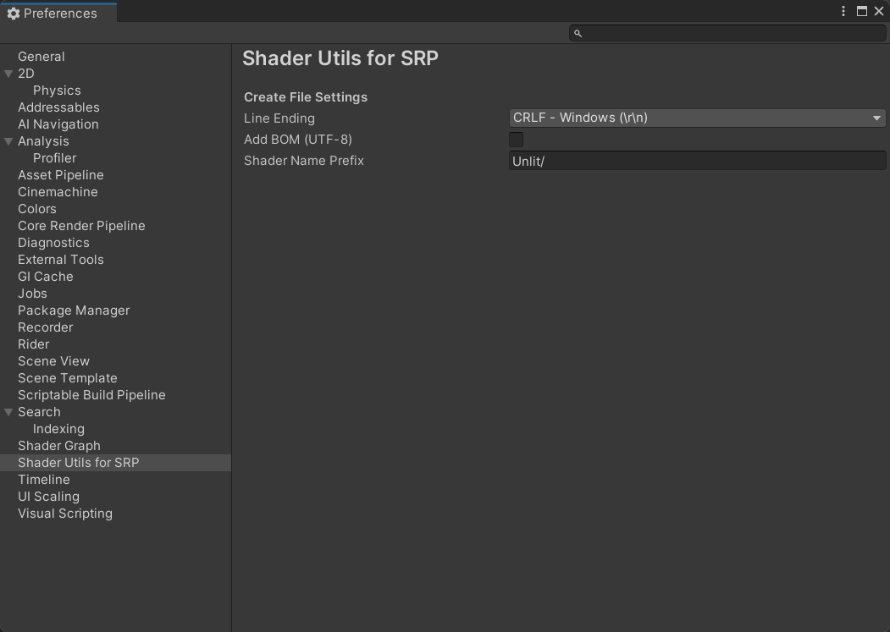

# Shader Utils for SRP v2

[](https://openupm.cn/packages/com.stalomeow.srp-shader-utils/)

Utilities for **SRP** shaders.

## Requirements

- Unity >= 2021.3.
- Core RP Library >= 12.0.0.

## File Extensions

Create HLSL and SRP Shader files easily using menu item.


## Preference Settings

Settings can be found in `Preferences/Shader Utils for SRP`.



## Advanced Shader GUI

Use `StaloSRPShaderGUI` as CustomEditor.

``` shaderlab
CustomEditor "StaloSRPShaderGUI"
```


### Advanced Shader Property Attributes

- `HeaderFoldout(label[, ...tooltips])`

    Begin an animated foldout header.

- `Indent([count])`

    Add indents before the property. The default count is 1.

- `HelpBox(None|Info|Warning|Error, ...messages)`

    Display a HelpBox above the property.

- `PostHelpBox(None|Info|Warning|Error, ...messages)`

    Display a HelpBox under the property.

- `MinMaxRange(min-limit, max-limit)`

    Display a vector property with a MinMaxSlider.

    - `property.x`: Min value.
    - `property.y`: Max value.

- `RampTexture`

    Display a texture as a ramp texture (similar to a color gradient).

- `SingleLineTextureNoScaleOffset([color-property])`

    Display a texture property in single line without `Tiling` and `Offset`. If `color-property` is specified, an additional color field will be displayed next to the texture.

- `TextureScaleOffset`

    Display a vector property as the `Tiling` and `Offset` of a texture.

    - `property.xy`: Tiling (Scale).
    - `property.zw`: Offset.


- `If(expr)`

    Display the property if `expr` evaluates to `true`. You can write complex expression like `((not _KEYWORD_A and true) or (_KEYWORD_B and not not not false)) and not _KEYWORD_C`.

    Operator precedence: `not` > `and` > `or`.

### Material Property Wrapper

This is similar to Unity's `MaterialPropertyDrawer`.

You can write a custom class inherited from `MaterialPropertyWrapper` (in namespace `Stalo.ShaderUtils.Editor`) to control the GUI of a material property.

Here's an example:

``` c#
internal class PostHelpBoxWrapper : MaterialPropertyWrapper
{
    private readonly MessageType m_MsgType;
    private readonly string m_Message;

    public PostHelpBoxWrapper(string rawArgs) : base(rawArgs)
    {
        string[] args = rawArgs.Split(',', StringSplitOptions.RemoveEmptyEntries);

        for (int i = 0; i < args.Length; i++)
        {
            args[i] = args[i].Trim();
        }

        m_MsgType = Enum.Parse<MessageType>(args[0]);
        m_Message = string.Join(", ", args[1..]);
    }

    public override void OnDidDrawProperty(MaterialProperty prop, string label, MaterialEditor editor)
    {
        EditorGUILayout.HelpBox(m_Message, m_MsgType);
    }
}
```
